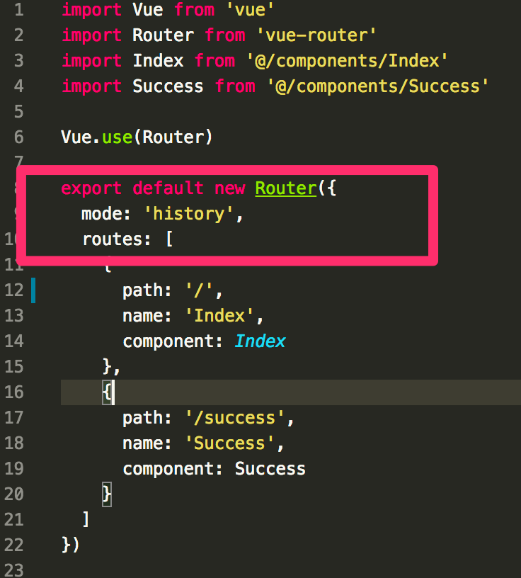
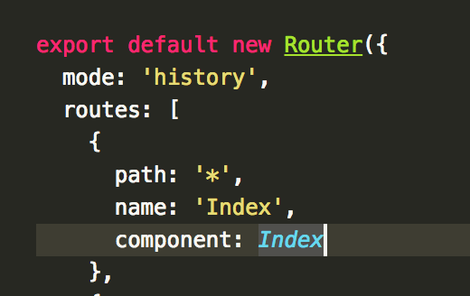

# history模式

::: tip
Vue-router默认使用hash分配路由，例如``http://localhost:2333/#/hello``，但是这样与正常习惯不同，而且#后面不能用来传参，#前面又是访问服务器的相对路径，也不能用来传参，所以地址栏中就没有传参的位置。
:::
启用vue-router 的 history模式 可以解决这个问题，history模式的启动方法：

使用history模式后，路由会在pathname中配置，
例如http://localhost:2333/#/hello就应该改为例如http://localhost:2333/hello/#/
这样#后面hash的位置就可以用来传参

解决后续路径问题：
如果在服务器的路径和路由不同的话，会出现错误，这时需要设置在任何路径下都自动跳转到index页面

